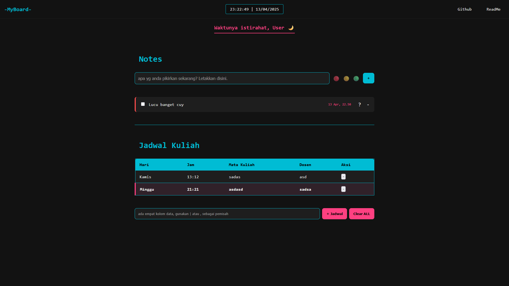

# Personal Dashboard Web App

> **"Literally Part 2."**

Aplikasi dashboard pribadi berbasis web modern yang dirancang untuk membantu pengguna mencatat ide, menjadwalkan kegiatan, dan mendapatkan greeting dinamis sesuai waktu. Dengan UI bergaya modern dan animasi yang menarik, aplikasi ini menawarkan pengalaman pengguna yang intuitif dan estetis.

---

## Fitur Utama

- **Task List dengan Label Warna**  
  Tambahkan catatan beserta label (🔴🟡🟢) untuk memvisualisasikan prioritas atau kategori.

- **Jadwal Kuliah Interaktif**  
  Tambahkan jadwal kuliah dengan format bebas (dipisahkan oleh `|` atau `,`), lengkap dengan kolom hari, jam, mata kuliah, dan dosen.

- **Highlight Hari Ini**  
  Baris jadwal yang sesuai dengan hari ini akan diberi highlight otomatis agar lebih mudah terlihat.

- **Greeting Otomatis Berdasarkan Waktu**  
  Menyapa pengguna sesuai jam saat ini seperti “Selamat Pagi” atau “Waktunya Reflecting...”.

- **Penyimpanan Otomatis**  
  Data tersimpan secara otomatis di `localStorage`, jadi tidak akan hilang saat reload halaman.

---

## Screenshot

---

## Fitur ES6+ yang Diimplementasikan

- **Arrow Functions**  
  Contoh: `const $ = (selector) => document.querySelector(selector);`

- **Modules & `import/export`**  
  Struktur kode modular dengan file terpisah seperti `taskManager.js`, `schedule.js`, dll.

- **Template Literals**  
  Digunakan untuk merender task dan jadwal secara dinamis ke dalam HTML.

- **Destructuring & Spread Syntax**  
  Digunakan dalam manipulasi data dan pengolahan array/objek.

- **Class & Encapsulation**  
  Struktur logika seperti manajemen task menggunakan pendekatan OOP.

- **Optional Chaining dan Nullish Coalescing**  
  Aman menangani data dari `localStorage`.

- **DOM Manipulation Modern & Event Delegation**

---

## Cara Menjalankan

Cukup buka `index.html` di browser lokal (tidak memerlukan server atau bundler tambahan).

---

## 🧾 Lisensi

Proyek ini dibuat untuk keperluan praktikum Web Programming. Silakan digunakan, dimodifikasi, dan dipelajari sebebasnya. Jangan lupa kasih credit ya 😄

---

