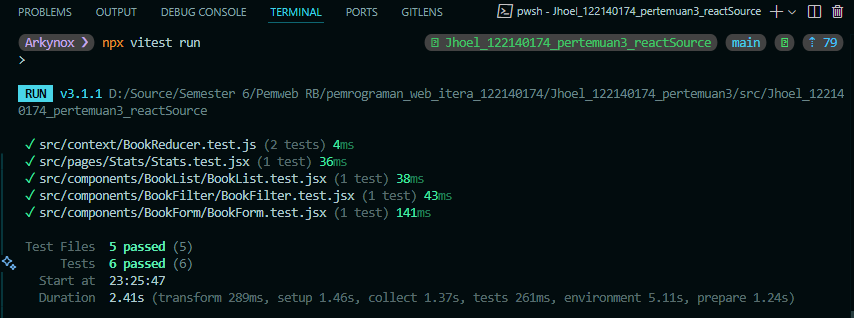

# Aplikasi MylistMybuku

Aplikasi berbasis **React + Vite** untuk mencatat dan mengelola koleksi buku pribadi.  
Pengguna dapat menambahkan buku yang dimiliki, sedang dibaca, atau ingin dibeli, serta melakukan pencarian, penyaringan, dan melihat statistik sederhana.

---

## Hasil deploy disini: [Link Website](https://arkyna.github.io/pemrograman_web_itera_122140174/Jhoel_122140174_pertemuan3/)

---

## Fitur Utama

- Menambahkan buku (judul, penulis, status)
- Mengedit dan menghapus buku
- Pencarian dan filter berdasarkan status
- Statistik buku
- Data tersimpan otomatis dengan `localStorage`
- Navigasi antar halaman dengan React Router
- Global state management menggunakan Context API

---

## Teknologi & Fitur React yang Digunakan

- `useState`, `useEffect`, `useContext`, `useMemo`
- **Custom Hooks**: 
  - `useLocalStorage` → sinkronisasi data
  - `useBookStats` → menghitung statistik buku
- `PropTypes` untuk validasi props
- `React Router` untuk navigasi multi-halaman
- **Context API** sebagai global state manager
- **Testing dengan React Testing Library** (5 unit test)
- **Error Handling**: Validasi input form untuk mencegah data kosong

---

## Cara Instalasi & Menjalankan

1. Clone repositori ini (not recommended unless you have your reason):

```bash
git clone https://github.com/Arkyna/pemrograman_web_itera_122140174.git
cd mybuk-simple
```

2. Install dependensi:

```bash
npm install
```

3. Jalankan aplikasi:

```bash
npm run dev
```

4. Buka di browser: [your local server]

---

## 📸 Screenshot Antarmuka

### Halaman Utama:


### Form Tambah/Edit:


### Statistik Buku:


---

## Laporan Testing

Testing dijalankan menggunakan `Vitest` dan `@testing-library/react`.

```bash
npx vitest run
```

### Hasil Screenshot:

- 

Total: **5 Unit Test**
- Validasi Form
- Render List Buku
- Filter Trigger
- Statistik Buku
- Reducer Logic

---

## Struktur Folder (sesuai ketentuan)

```
src/
├── components/
│   ├── BookForm/
│   ├── BookList/
│   └── BookFilter/
├── pages/
│   ├── Home/
│   └── Stats/
├── hooks/
│   ├── useLocalStorage.js
│   └── useBookStats.js
├── context/
│   ├── BookContext.js
│   └── BookProvider.jsx
├── styles/
│   └── main.css
├── App.jsx
└── main.jsx
```

---

## Catatan Akhir

Komentar telah ditambahkan dalam file JavaScript:

- Reducer logic
- Form validation
- Custom hook
- Filter & search handling

